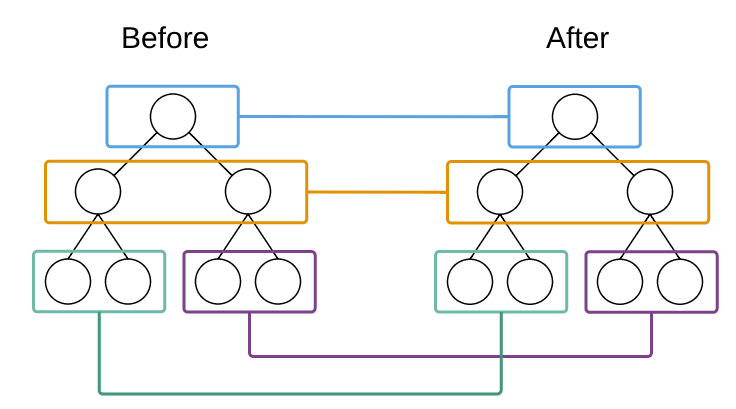

## 5.框架的使用

### 解释单向数据流和双向数据绑定

只有 UI 控件 才存在双向，非 UI控件 只有单向。全局性数据流使用单向，易跟踪调试。局部性数据流使用双向，简单易用。

- [单向数据绑定和双向数据绑定的优缺点，适合什么场景？](https://www.zhihu.com/question/49964363)
- [React 应用的架构模式 Flux](http://stylechen.com/react-flux.html)

### Vue双向绑定实现原理 

➤ 参考资料：[《剖析Vue原理&实现双向绑定MVVM》](https://segmentfault.com/a/1190000006599500)

- 单向数据流架构在哪些方面适合MVC ？

  MVC 拥有大约 50 年的悠久历史，并已演变为 MVP，MVVM 和 MV *。两者之间的相互关系是什么？如果 MVC 是架构模式，那么单向数据流是什么？这些竞争模式是否能解决同样的问题？

### Vue对比其他框架(主要关注 React)

1. React需要开发者更多的关注子组件的重渲染，如何的避免这个问题引起的性能问题，然而在 Vue 应用中，组件的依赖是在渲染过程中自动追踪的，所以系统能精确知晓哪个组件确实需要被重渲染。你可以理解为每一个组件都已经自动获得了 `shouldComponentUpdate`，并且没有上述的子树问题限制。因此 Vue 的这个特点使得开发者不再需要考虑此类优化，<u>从而能够更好地专注于应用本身。</u>
2. Vue 的路由库和状态管理库都是由官方维护支持且与核心库同步更新的。React 则是选择把这些问题交给社区维护，因此创建了一个更分散的生态系统。但相对的，React 的生态系统相比 Vue 更加繁荣。
3. React 比 Vue 更好的地方，比如更丰富的生态系统，React 国际大厂的维护，Vue 初期则是个人开发者。

> 更多对比查看 Vue 官方解释https://cn.vuejs.org/v2/guide/comparison#React

### 客户端 MVC 与服务器端或经典 MVC 有何不同？

```
提示：经典 MVC 是适用于桌面应用程序的 Smalltalk MVC。在 Web 应用中，至少有两个不同的数据 MVC 周期。
```

### 不可变数据结构（immutable data structures）解决了哪些问题？

可变数据的好处是 **节省内存 **或 **利用可变性做一些事情**，但在复杂的开发中它的副作用也挺多，于是出现了浅拷贝和深拷贝，JavaScript 原生方法里都是浅拷贝(例如Object.assign、Object.freeze、ES6中的解构)，在实际开发中浅拷贝通常不够用，于是 Facebook 推出来了不可变数据结构 Immutable.js

在 React 开发中，频繁操作 `State 对象`或是 `Store`，Render 方法根据数据改变来执行，可变数据可能导致性能上的浪费，如果配合 immutable.js 快速、安全、方便，可以避免这种问题。

immutable.js在数据比较上也有优化，只需要对外层数据判断即可(如果数据结构比较深，可避免数据比较带来的性能问题)，但 API 上设计过于细致，导致库脚本本身比较重，因此不太适用于移动端。

➤ 参考资料：[facebook immutable.js 意义何在，使用场景？](https://www.zhihu.com/question/28016223)

### 大型应用程序是否应使用静态类型？

```
如何比较 TypeScript/Flow 与 Elm/ReasonML/PureScript 等 JS 转换语言？这些方法的优缺点是什么？
```

### Vue 和 React的一些优点？

几个切入点：

- 数据驱动
- 数据单向流
- 虚拟DOM（可减少直接操作DOM，性能上的优化）
- Vue 的双向绑定（原理：**Object.defineProperty()来实现数据劫持**、发布者-订阅者模式。 [参考资料](https://juejin.im/entry/5923973da22b9d005893805a) ）
- 无缝结合 webpack 等打包工具，使得开发模式更现代，具有模块化、组件化式的。

### React 生命周期图谱 

➤ 参考资料：https://t.cn/RmV1t56


### 如何理解虚拟DOM? 

<details>
<summary>查看解析</summary>

参考资料：[如何理解虚拟DOM? @zhihu](https://www.zhihu.com/question/29504639)

- 步骤一：用JS对象模拟DOM树
- 步骤二：比较两棵虚拟DOM树的差异 → 深度优先遍历，标记并记录差异 → 差异类型 → 列表对比算法
- 步骤三：把差异应用到真正的DOM树上

关键技术：batching(批处理)、Diff算法的优化:

```
batching(批处理)：将所有DOM的操作搜集打包在js对象中完成，然后一次性的递交给真实DOM（性能上只刷新一次）
Diff算法的优化：将标准的diff算法的O(n^3)复杂度降低到了O(n)，主要得益于对新旧DOM树进行了一个深度的优先遍历，并对每个节点做唯一 id 标记
```

逐层进行节点比较


更多解析：[深入浅出 React（四）：虚拟 DOM Diff 算法解析](https://infoq.cn/article/react-dom-diff)

> Tips：由于特有的 DOM Diff 算法，我们在实现自己的组件时，保持稳定的 DOM 结构会有助于性能的提升。例如，我们有时可以通过 CSS 隐藏或显示某些节点，而不是真的移除或添加 DOM 节点。

优势：结合Node Server层来说，实现服务端与浏览器端的同构更为方便。

类比：CPU 内存(纯JS操作)和硬盘(纯DOM操作)的关系。

</details>

### React 组合 vs 继承

### 组合方式

组件可以接受任意 props，包括基本数据类型，React 元素以及函数。

1. 包含关系
2. 特例关系

### React 组件模式有哪几种？

1. 有状态(stateful)组件 和 无状态(stateless)组件

2. 容器(Container) 组件 和 展示(Presentational) 组件

3. 高阶组件(Higher order components , HOC ）

   ### 高阶组件概念

   高阶组件是**<u>参数为组</u>件**，<u>**返回值**</u>为新组件的函数。(组件以参数形式进入，返回一个新组件，说白了就是抽象，并没多高阶...)

   ### 一些建议

   1. HOC 是纯函数，没有副作用。
   2. HOC 不应该修改传入组件，而应该使用组合的方式，通过将组件包装在容器组件中实现功能。

   ### HOC 与容器组件模式的区别？

   ### 什么事柯里化？

   柯里化：只传递给函数一部分参数来调用它，让它返回一个函数去处理剩下的参数。

   Currying 使用场景：参数复用、延迟执行。

4. 渲染回调（Render Callbacks）：`this.props.children`方式，也就是函数作为子组件。

5. 新的 API：Hooks

> 参考：[[译]React 组件模式](https://github.com/yueshuiniao/blog/issues/1)

### React 组件之间通信方式？

### 常见应用场景

1. 父组件 → 子组件：利用`props`实现数据传递
2. 子组件 → 父组件：

   - 回调函数实现，依靠父组件传下来的 `callback` 函数执行，改变 父组件 组件的状态，或者把 子组件 的 state 通知 父组件 。
   - 自定义事件机制
3. 跨层级（祖孙）组件：

   - 层层组件传递`props`

   - 使用`context`技术
4. 兄弟组件：通常是依赖共有的顶级容器（即共有父组件）处理
5. 无嵌套关系组件：自定义事件机制，常用的有发布/订阅模式，通常是依赖共有的顶级容器处理或者第三方的状态管理器（如Redux/Mbox）。其实原理都是相通的，兄弟 A （发布者）的 value 发生变化，分发的时候把 value 值告诉一个中间者 C（订阅者） ，C 会自动告知 B，实现 B 的自动render 。

### 终极解决方案：

如果你的项目非常大，那可能需要一个状态管理工具，通过状态管理工具把组件之间的关系，和关系的处理逻辑从组建中抽象出来，并集中化到统一的地方来处理，Redux就是一个非常不错的状态管理工具，当然还有这些Mobx、Rematch、reselect 不错的工具。

> 参考：
>
> - [React组件之间的通信](https://github.com/sunyongjian/blog/issues/27)
>
> - [ReactJS 组件间沟通的一些方法（From Alloyteam）](http://www.alloyteam.com/2016/01/some-methods-of-reactjs-communication-between-components/)

### Fragments

多个组件并排渲染，需要使用一个 HTML 比偶钱包过，一般增加一个 `<div>`  即可，但引起了 DOM 结构的冗([rǒng])余，于是出现了 `Fragment`，直接用 `<React.Fragment>` 代替 `<div>`

### 单页面应用路由实现原理

[以 React-Router 为例](https://github.com/youngwind/blog/issues/109#)

### React Hooks

参考资料：

1. [精读《怎么用 React Hooks 造轮子》](https://juejin.im/post/5bf20ce6e51d454a324dd0e6)
2. [Hook 官方解读](https://zh-hans.reactjs.org/docs/hooks-intro.html)

## 6.CSS布局基础

### BOM盒模型 

- [box-sizing MDN](https://developer.mozilla.org/zh-CN/docs/Web/CSS/box-sizing) 
- 浮动、文档流

### 纯 CSS 盒子水平垂直居中的实现方法

查看 [Demo](https://zhuziyi1989.github.io/demo/box-center.html)

### 动画相关

### Canvas 和 svg

### 移动端布局方案

- flex （[图解CSS3 Flexbox属性](https://www.w3cplus.com/css3/a-visual-guide-to-css3-flexbox-properties.html)）
- css-grid
- rem
- vw和vh
- 媒体查询
- 百分比

问题例子：

- 因使用了标准盒模型，盒子的 border 必然导致盒子挤出去，那么如何实现边框？
  答：用阴影或者outline来画线更加巧妙。
- 

## 7.前端构架和开发效率

### Git 重点和难点总结(单独)

### 代码编辑器 Vscode

### 项目管理工具、BUG管理工具

### Webpack 相关技术难点(单独)

- [webpack热更新流程 #238](https://github.com/kaola-fed/blog/issues/238)
- EventSource → Websocket
- webpack 中 loader 和 plugin 的区别是什么？
  - loader，是一个转换器，将A文件进行编译成B文件，比如：将A.less转换为B.css，单纯的文件转换过程。
  - plugin，是一个扩展器，它丰富了webpack本身，针对是loader结束后，webpack打包的整个过程，它并不直接操作文件，而是基于事件机制工作，会监听webpack打包过程中的某些节点，执行广泛的任务


## 8.算法、数据结构、计算机基础等

### 有哪些基本的算法？

1. [Leetcode中文](https://leetcode-cn.com/)
2. ["所谓"的前端算法](https://github.com/zhaoqize/blog/issues/18#) 

### 二进制, 十进制, 十六进制, 科学记数法

### 耗性能操作和时间复杂度

### 前端自动化测试

## 9.综合性问题

### 自我介绍

### 介绍印象最深刻的项目

### 高并发高可用的前端架构

场景：诸如京东6.18和双十一这类时期，要求采用高并发、高可用的前端架构，

① 利用**缓存**
    浏览器的静态资源缓存、静态资源的 **cdn** 缓存、分布式缓存、服务端缓存。可在 `localStorage` 里做很多优化，充分利用客户端资源，可在客户端储存一些不常改变的静态数据、base64编码形式的图片。

② 升级为 http2 推送

③ **合并压缩**资源

④ 避免高频刷新页面获取数据

⑤ 设置响应头 cache-control 和 last-modifie

## 10.面试分享和学习资料

见 README

