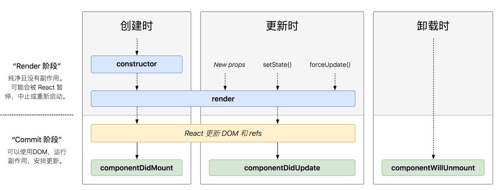

前端知识体系不完全记录

## 目录

1. [JS 语言基础](#1js语言基础)
2. [客户端及其内核原理](#2客户端及其内核原理)
3. [服务端应用](#3服务端应用)
4. [网络原理](#4网络原理)
5. [框架的使用](#5框架的使用)
6. [CSS 布局基础](#6CSS布局基础)
7. [前端构架和开发效率](#7前端构架和开发效率)
8. [算法、数据结构、计算机基础等](#8算法数据结构计算机基础等)
9. [综合性问题](#9综合性问题)
10. [面试分享和学习资料](#10面试分享和学习资料)

## 1.JS语言基础 [more...](./js-basic.md)

## 2.客户端及其内核原理

- 浏览器内核：V8引擎、
- 进程(系统层面)：操作系统分配资源的最小单位，独立。比如一个Chome程序，或一个标签页。
- 线程(内核层面)：操作系统能够进行运算调度的最小单位，共享。渲染线程/JS引擎/事件触发/定时器触发/异步HTTP请求，
- 回流和重绘，以及优化方案 [link](https://juejin.im/post/5c39aeba6fb9a049b41cb0ee)

### JS引擎的基础概念

调用堆栈：

```
V8引擎主要由两部分组成:
	① 内存堆：这是内存分配发生的地方
	② 调用栈：这是你的代码执行时的地方
```

概念：[Call Stack — MDN](https://developer.mozilla.org/zh-CN/docs/Glossary/Call_stack)

堆栈溢出？堆栈溢出的产生是由于过多的函数调用，导致调用堆栈无法容纳这些调用的返回地址，一般在递归中产生。

参考资料：[JavaScript 如何工作：对引擎、运行时、调用堆栈的概述](https://juejin.im/post/5a05b4576fb9a04519690d42)

### 事件循环(EventLoop)

JavaScript语言的两个特点：单线程(why? 确保程序执行的一致性)、非阻塞(why? 可完成异步任务)

执行优先级：同步任务 > 微任务(new Promise()) > 宏任务(setTimeout())

```javascript
(function() {

  console.log('1.这是同步开始');

  setTimeout(function cb() {
    console.log('7.这是来自第一个回调的消息');
  });

  console.log('2.这是一条同步消息');

  setTimeout(function cb1() {
    console.log('8.这是来自第二个回调的消息');
  }, 0);

  console.log('3.这是一条同步消息');

  new Promise(function(resolve,reject){
      console.log('4.这是一条同步消息') //注意这也是同步消息
      resolve('ok')
  }).then(function(val){
      console.log('6.这是来自第三个回调的消息' + val);
  })

  console.log('5.这是同步结束');

  return 6.5 // 同步消息结束立即执行

})();
```

参考资料：[并发模型与事件循环(MDN)](https://developer.mozilla.org/zh-CN/docs/Web/JavaScript/EventLoop) 、[详解JavaScript中的事件循环机制(知乎)](https://zhuanlan.zhihu.com/p/33058983)、[JavaScript定时器与执行机制解析(alloyteam)](http://www.alloyteam.com/2016/05/javascript-timer/)

## 3.服务端应用

- [Node.js 基础指南](https://nodejs.org/zh-cn/docs/guides/)
- Koa
- 服务器管理(Linux、Centos等)
- Nginx 的使用

### Node.js中的事件循环是什么？

`事件循环`是 Node.js 处理**非阻塞 I/O 操作**的机制，尽管 JavaScript 是单线程处理的。当有可能的时候，它们会把操作转移到系统内核中去。

## 4.网络原理

### 简单讲解一下 HTTP2 的多路复用？

<details>
<summary>查看解析</summary>

在 HTTP/1 中，每次请求都会建立一次TCP连接，也就是我们常说的3次握手4次挥手，这在一次请求过程中占用了相当长的时间，即使开启了 Keep-Alive ，解决了多次连接的问题，但是依然有两个效率上的问题：

- 第一个：串行的文件传输。当请求a文件时，b文件只能等待，等待a连接到服务器、服务器处理文件、服务器返回文件，这三个步骤。我们假设这三步用时都是1秒，那么a文件用时为3秒，b文件传输完成用时为6秒，依此类推。（注：此项计算有一个前提条件，就是浏览器和服务器是单通道传输）
- 第二个：连接数过多。我们假设Apache设置了最大并发数为300，因为浏览器限制，浏览器发起的最大请求数为6（Chrome），也就是服务器能承载的最高并发为50，当第51个人访问时，就需要等待前面某个请求处理完成。

HTTP2采用二进制格式传输，取代了HTTP1.x的文本格式，二进制格式解析更高效。
多路复用代替了HTTP1.x的序列和阻塞机制，所有的相同域名请求都通过同一个TCP连接并发完成。在HTTP1.x中，并发多个请求需要多个TCP连接，浏览器为了控制资源会有6-8个TCP连接都限制。
HTTP2中

- 同域名下所有通信都在单个连接上完成，消除了因多个 TCP 连接而带来的延时和内存消耗。
- 单个连接上可以并行交错的请求和响应，之间互不干扰

**总结**：HTTP/2的多路复用就是为了解决上述的两个性能问题。
在 HTTP/2 中，有两个非常重要的概念，分别是帧（frame）和流（stream）。
帧代表着最小的数据单位，每个帧会标识出该帧属于哪个流，流也就是多个帧组成的数据流。
多路复用，就是在一个 TCP 连接中可以存在多条流。换句话说，也就是可以发送多个请求，对端可以通过帧中的标识知道属于哪个请求。通过这个技术，可以避免 HTTP 旧版本中的队头阻塞问题，极大的提高传输性能。[More...](https://github.com/Advanced-Frontend/Daily-Interview-Question/issues/14)

</details>

### 五(七)层因特网协议栈？

- （应用层）HTTP/DNS/FTP等，HTTP 与 HTTPS 的区别？DNS 域名解析过程？
- （传输层）TCP/IP 协议
- （网络层）IP/ARP 寻址，路由器
- （数据链路层）封装成帧，交换机
- （物理层）光纤/网线/无线电磁波等

### HTTP 相关问题

- 强缓存  & 协商缓存
- 跨域的原因及处理方式 [参考资料](https://tech.jandou.com/cross-domain.html)
- get 与 post
- 通用头部、请求/响应头、请求/响应体
- 常用的状态码  200 301 302 304 400 404 500 501 503

### TCP/IP 相关原理及延伸

<details>
<summary>查看解析</summary>

- 为什么握手需要三次，而挥手却需要四次？ ➤为了防止_已失效的_连接请求报文段突然又传送到了服务端，因而产生错误。握手过程中传送的包里不包含数据。
- 为什么要四次挥手？ ➤主机双方相互确认结束报文的发送，并应答对方。
- 为什么要等待2MSL？ ➤ ①.保证TCP协议的全双工连接能够_可靠关闭_；②.保证这次连接的_重复数据段从网络中消失_。备注：MSL是任何报文段被丢弃前在网络内的最长时间。

参考资料：

- [关于 TCP/IP，必知必会的十个问题](https://juejin.im/post/598ba1d06fb9a03c4d6464ab)
- [通俗大白话来理解TCP协议的三次握手和四次分手 #14](https://github.com/jawil/blog/issues/14)
- [掘金搜索TCP结果](https://juejin.im/search?query=tcp&type=all)

</details>

### 跨域资源共享(CORS) 机制

策略：同源策略  ( [源]被定义为 URI、主机名和端口号的组合 )

作用：浏览器作为"安全裁判"，用于隔离潜在恶意数据的重要安全机制

解决方案：

- JSONP (兼容性好，但数据量小，GET请求)
- WebSocket (该协议不受同源政策限制)
- 反向代理（Nginx 服务内部配置 Access-Control-Allow-Origin 选项为 *）
- CORS 前后端协作设置请求头部，如设置 Access-Control-Allow-Origin 等头部信息( "简单请求"；[`OPTIONS`](https://developer.mozilla.org/zh-CN/docs/Web/HTTP/Methods/OPTIONS) 方法预检请求 )
- iframe 嵌套通讯。关键技术：① 改变片段标识符，通过 `hashchange` 事件监听；② 利用 `window.name` 属性(影响性能)
- HTML5 新 API：`window.postMessage()`，通过`message`事件监听。

思考题：

- 为什么form表单提交没有跨域问题，但ajax提交有跨域问题？提示：<u>因为原页面用 form 提交到另一个域名之后，原页面的脚本无法获取新页面中的内容。</u>


参考资料：

- [HTTP访问控制（CORS） - MDN](https://developer.mozilla.org/zh-CN/docs/Web/HTTP/Access_control_CORS)
- [浏览器同源政策及其规避方法](http://www.ruanyifeng.com/blog/2016/04/same-origin-policy.html)
- [前端跨域及其解决方案](https://tech.jandou.com/cross-domain.html)

### 正向代理和反向代理的区别？

### 如何部署大型 CDN ？

### 跨域认证问题(JWT)

1. session + Cookie
2. JSON Web Token

JSON Web Token（缩写 JWT）是目前最流行的跨域认证解决方案

> 阮一峰：[JSON Web Token 入门教程](http://www.ruanyifeng.com/blog/2018/07/json_web_token-tutorial.html)

## 5.框架的使用

### 解释单向数据流和双向数据绑定

只有 UI 控件 才存在双向，非 UI控件 只有单向。全局性数据流使用单向，易跟踪调试。局部性数据流使用双向，简单易用。

- [单向数据绑定和双向数据绑定的优缺点，适合什么场景？](https://www.zhihu.com/question/49964363)
- [React 应用的架构模式 Flux](http://stylechen.com/react-flux.html)

### Vue双向绑定实现原理 

➤ 参考资料：[《剖析Vue原理&实现双向绑定MVVM》](https://segmentfault.com/a/1190000006599500)

- 单向数据流架构在哪些方面适合MVC ？

  MVC 拥有大约 50 年的悠久历史，并已演变为 MVP，MVVM 和 MV *。两者之间的相互关系是什么？如果 MVC 是架构模式，那么单向数据流是什么？这些竞争模式是否能解决同样的问题？

### Vue对比其他框架(主要关注 React)

1. React需要开发者更多的关注子组件的重渲染，如何的避免这个问题引起的性能问题，然而在 Vue 应用中，组件的依赖是在渲染过程中自动追踪的，所以系统能精确知晓哪个组件确实需要被重渲染。你可以理解为每一个组件都已经自动获得了 `shouldComponentUpdate`，并且没有上述的子树问题限制。因此 Vue 的这个特点使得开发者不再需要考虑此类优化，<u>从而能够更好地专注于应用本身。</u>
2. Vue 的路由库和状态管理库都是由官方维护支持且与核心库同步更新的。React 则是选择把这些问题交给社区维护，因此创建了一个更分散的生态系统。但相对的，React 的生态系统相比 Vue 更加繁荣。
3. React 比 Vue 更好的地方，比如更丰富的生态系统，React 国际大厂的维护，Vue 初期则是个人开发者。

> 更多对比查看 Vue 官方解释https://cn.vuejs.org/v2/guide/comparison#React

### 客户端 MVC 与服务器端或经典 MVC 有何不同？

```
提示：经典 MVC 是适用于桌面应用程序的 Smalltalk MVC。在 Web 应用中，至少有两个不同的数据 MVC 周期。
```

### 不可变数据结构（immutable data structures）解决了哪些问题？

可变数据的好处是 **节省内存 **或 **利用可变性做一些事情**，但在复杂的开发中它的副作用也挺多，于是出现了浅拷贝和深拷贝，JavaScript 原生方法里都是浅拷贝(例如Object.assign、Object.freeze、ES6中的解构)，在实际开发中浅拷贝通常不够用，于是 Facebook 推出来了不可变数据结构 Immutable.js

在 React 开发中，频繁操作 `State 对象`或是 `Store`，Render 方法根据数据改变来执行，可变数据可能导致性能上的浪费，如果配合 immutable.js 快速、安全、方便，可以避免这种问题。

immutable.js在数据比较上也有优化，只需要对外层数据判断即可(如果数据结构比较深，可避免数据比较带来的性能问题)，但 API 上设计过于细致，导致库脚本本身比较重，因此不太适用于移动端。

➤ 参考资料：[facebook immutable.js 意义何在，使用场景？](https://www.zhihu.com/question/28016223)

### 大型应用程序是否应使用静态类型？

```
如何比较 TypeScript/Flow 与 Elm/ReasonML/PureScript 等 JS 转换语言？这些方法的优缺点是什么？
```

### Vue 和 React的一些优点？

几个切入点：

- 数据驱动
- 数据单向流
- 虚拟DOM（可减少直接操作DOM，性能上的优化）
- Vue 的双向绑定（原理：**Object.defineProperty()来实现数据劫持**、发布者-订阅者模式。 [参考资料](https://juejin.im/entry/5923973da22b9d005893805a) ）
- 无缝结合 webpack 等打包工具，使得开发模式更现代，具有模块化、组件化式的。

### React 生命周期图谱 

➤ 参考资料：https://t.cn/RmV1t56



### 如何理解虚拟DOM? 

<details>
<summary>查看解析</summary>

参考资料：[如何理解虚拟DOM? @zhihu](https://www.zhihu.com/question/29504639)

- 步骤一：用JS对象模拟DOM树
- 步骤二：比较两棵虚拟DOM树的差异 → 深度优先遍历，标记并记录差异 → 差异类型 → 列表对比算法
- 步骤三：把差异应用到真正的DOM树上

关键技术：batching(批处理)、Diff算法的优化:

```
batching(批处理)：将所有DOM的操作搜集打包在js对象中完成，然后一次性的递交给真实DOM（性能上只刷新一次）
Diff算法的优化：将标准的diff算法的O(n^3)复杂度降低到了O(n)，主要得益于对新旧DOM树进行了一个深度的优先遍历，并对每个节点做唯一 id 标记
```

逐层进行节点比较


更多解析：[深入浅出 React（四）：虚拟 DOM Diff 算法解析](https://infoq.cn/article/react-dom-diff)

> Tips：由于特有的 DOM Diff 算法，我们在实现自己的组件时，保持稳定的 DOM 结构会有助于性能的提升。例如，我们有时可以通过 CSS 隐藏或显示某些节点，而不是真的移除或添加 DOM 节点。

优势：结合Node Server层来说，实现服务端与浏览器端的同构更为方便。

类比：CPU 内存(纯JS操作)和硬盘(纯DOM操作)的关系。

</details>

### React 组合 vs 继承

### 组合方式

组件可以接受任意 props，包括基本数据类型，React 元素以及函数。

1. 包含关系
2. 特例关系

### React 组件模式有哪几种？

1. 有状态(stateful)组件 和 无状态(stateless)组件

2. 容器(Container) 组件 和 展示(Presentational) 组件

3. 高阶组件(Higher order components , HOC ）

   ### 高阶组件概念

   高阶组件是**<u>参数为组</u>件**，<u>**返回值**</u>为新组件的函数。(组件以参数形式进入，返回一个新组件，说白了就是抽象，并没多高阶...)

   ### 一些建议

   1. HOC 是纯函数，没有副作用。
   2. HOC 不应该修改传入组件，而应该使用组合的方式，通过将组件包装在容器组件中实现功能。

   ### HOC 与容器组件模式的区别？

   ### 什么事柯里化？

   柯里化：只传递给函数一部分参数来调用它，让它返回一个函数去处理剩下的参数。

   Currying 使用场景：参数复用、延迟执行。

4. 渲染回调（Render Callbacks）：`this.props.children`方式，也就是函数作为子组件。

5. 新的 API：Hooks

> 参考：[[译]React 组件模式](https://github.com/yueshuiniao/blog/issues/1)

### React 组件之间通信方式？

### 常见应用场景

1. 父组件 → 子组件：利用`props`实现数据传递
2. 子组件 → 父组件：

   - 回调函数实现，依靠父组件传下来的 `callback` 函数执行，改变 父组件 组件的状态，或者把 子组件 的 state 通知 父组件 。
   - 自定义事件机制
3. 跨层级（祖孙）组件：

   - 层层组件传递`props`

   - 使用`context`技术
4. 兄弟组件：通常是依赖共有的顶级容器（即共有父组件）处理
5. 无嵌套关系组件：自定义事件机制，常用的有发布/订阅模式，通常是依赖共有的顶级容器处理或者第三方的状态管理器（如Redux/Mbox）。其实原理都是相通的，兄弟 A （发布者）的 value 发生变化，分发的时候把 value 值告诉一个中间者 C（订阅者） ，C 会自动告知 B，实现 B 的自动render 。

### 终极解决方案：

如果你的项目非常大，那可能需要一个状态管理工具，通过状态管理工具把组件之间的关系，和关系的处理逻辑从组建中抽象出来，并集中化到统一的地方来处理，Redux就是一个非常不错的状态管理工具，当然还有这些Mobx、Rematch、reselect 不错的工具。

> 参考：
>
> - [React组件之间的通信](https://github.com/sunyongjian/blog/issues/27)
>
> - [ReactJS 组件间沟通的一些方法（From Alloyteam）](http://www.alloyteam.com/2016/01/some-methods-of-reactjs-communication-between-components/)

### Fragments

多个组件并排渲染，需要使用一个 HTML 比偶钱包过，一般增加一个 `<div>`  即可，但引起了 DOM 结构的冗([rǒng])余，于是出现了 `Fragment`，直接用 `<React.Fragment>` 代替 `<div>`

### 单页面应用路由实现原理

[以 React-Router 为例](https://github.com/youngwind/blog/issues/109#)

### React Hooks

参考资料：

1. [精读《怎么用 React Hooks 造轮子》](https://juejin.im/post/5bf20ce6e51d454a324dd0e6)
2. [Hook 官方解读](https://zh-hans.reactjs.org/docs/hooks-intro.html)

## 6.CSS布局基础

### BOM盒模型 

- [box-sizing MDN](https://developer.mozilla.org/zh-CN/docs/Web/CSS/box-sizing) 
- 浮动、文档流

### 纯 CSS 盒子水平垂直居中的实现方法

查看 [Demo](https://zhuziyi1989.github.io/demo/box-center.html)

### 动画相关

### Canvas 和 svg

### 移动端布局方案

- flex （[图解CSS3 Flexbox属性](https://www.w3cplus.com/css3/a-visual-guide-to-css3-flexbox-properties.html)）
- css-grid
- rem
- vw和vh
- 媒体查询
- 百分比

问题例子：

- 因使用了标准盒模型，盒子的 border 必然导致盒子挤出去，那么如何实现边框？
  答：用阴影或者outline来画线更加巧妙。
- 

## 7.前端构架和开发效率

### Git 重点和难点总结(单独)

### 代码编辑器 Vscode

### 项目管理工具、BUG管理工具

### Webpack 相关技术难点(单独)

- [webpack热更新流程 #238](https://github.com/kaola-fed/blog/issues/238)

EventSource → Websocket

## 8.算法、数据结构、计算机基础等

### 有哪些基本的算法？

1. [Leetcode中文](https://leetcode-cn.com/)
2. ["所谓"的前端算法](https://github.com/zhaoqize/blog/issues/18#) 

### 二进制, 十进制, 十六进制, 科学记数法

### 耗性能操作和时间复杂度

### 前端自动化测试

## 9.综合性问题

### 自我介绍

### 介绍印象最深刻的项目

### 高并发高可用的前端架构

场景：诸如京东6.18和双十一这类时期，要求采用高并发、高可用的前端架构，

① 利用**缓存**
    浏览器的静态资源缓存、静态资源的 **cdn** 缓存、分布式缓存、服务端缓存。可在 `localStorage` 里做很多优化，充分利用客户端资源，可在客户端储存一些不常改变的静态数据、base64编码形式的图片。

② 升级为 http2 推送

③ **合并压缩**资源

④ 避免高频刷新页面获取数据

⑤ 设置响应头 cache-control 和 last-modifie

## 10.面试分享和学习资料

### 面试分享

- [半年经验面试阿里前端P6](https://juejin.im/post/5a92c23b5188257a6b06110b)
- [前端面试分享: 两年经验社招-阿里巴巴](https://segmentfault.com/a/1190000013538920)
- [2019年前端面试都聊啥？一起来看看](https://juejin.im/post/5bf5610be51d452a1353b08d)
- [中高级前端大厂面试秘籍，为你保驾护航金三银四，直通大厂(上)](https://juejin.im/post/5c64d15d6fb9a049d37f9c20)
- [记一次“失利后”经过半年准备通过阿里社招的经历与感悟](https://segmentfault.com/a/1190000013129650)
- 30秒系列
  - 30秒JS (link: https://github.com/30-seconds/30-seconds-of-code) 
  - 30秒CSS (link: https://30-seconds.github.io/30-seconds-of-css/)
  - 30秒面试 (link: https://30secondsofinterviews.org/) 
  - 30秒React (link: https://github.com/30-seconds/30-seconds-of-react) 
  - 30秒Python (link: https://github.com/kriadmin/30-seconds-of-python-code) 
  - 30秒PHP (link: https://github.com/appzcoder/30-seconds-of-php-code) 
- [前端开发人员手册2019 From frontend masters](https://frontendmasters.com/books/front-end-handbook/2019)
- [自我检测：前端面试题列表 JS 部分](https://github.com/yangshun/front-end-interview-handbook/blob/master/Translations/Chinese/questions/javascript-questions.md)
- [自我检测：前端面试题列表 CSS 部分](https://github.com/yangshun/front-end-interview-handbook/blob/master/Translations/Chinese/questions/css-questions.md)
- [2019前端面试题--这样准备，拿不到offer算我输！](https://juejin.im/post/5cbff661e51d456e693f48ec)
- [三年前端，面试思考（头条蚂蚁美团offer）](https://juejin.im/post/5bd97627f265da39651c0a4b)
- [2018大厂高级前端面试题汇总](https://juejin.im/post/5bc92e9ce51d450e8e777136#heading-19)
- [2019面试 你必须要懂的原生JS知识点](https://juejin.im/post/5cb7b62b5188253772753c01)

### 学习资料

- JS 基础类《JavaScript高级程序设计》（第3版）

- 网络类《HTTP权威指南》

- CSS 基础类《CSS揭秘》

- [ECMAScript 6 入门 (阮一峰)](http://es6.ruanyifeng.com/)

- JS 基础书籍《You-Dont-Know-JS》 [Github在线阅读](https://github.com/getify/You-Dont-Know-JS/tree/1ed-zh-CN)

  购买链接：[你不知道的JavaScript（上卷）](https://u.jd.com/mwU5Oo) 、  [你不知道的JavaScript（中卷）](https://u.jd.com/jHylwd)  、 [你不知道的JavaScript（下卷）](https://u.jd.com/iO9Z43)

- [React  小书](http://huziketang.com/books/react/)

- [React 官方文档](https://zh-hans.reactjs.org/docs/)

- [Redux 文档](http://cn.redux.js.org/)

- [React 组件间通讯 Taobao FED](http://taobaofed.org/blog/2016/11/17/react-components-communication/)

- [现代 JavaScript 教程](https://zh.javascript.info/)

- [MDN](https://developer.mozilla.org/zh-CN/)

- [React API 速查](http://devhints.cn/react)

